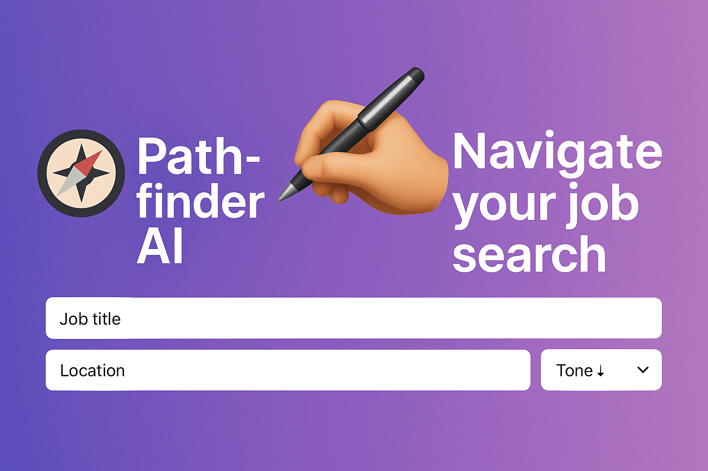

  

Pathfinder AI: Career Coach

Pathfinder AI is a resume-boosting, job-finding assistant built with Generative AI, LangChain, FAISS, and real-time job search APIs. Whether you're a marketing specialist or a cybersecurity analyst, Pathfinder helps you:

✅ Instantly generate resume summaries tailored to your goals

🔍 Search for real-time job listings by title and location

📎 Upload your PDF resume for AI-powered pattern matching (optional)

🚀 How It Works

Fill out your name, current role, key skills, and goal

Choose a tone for your resume summary

(Optional) Upload your current resume in PDF format

Click "Generate" to:

Create a personalized resume summary with Gemini

View job listings via the JSearch API

🔧 Setup & Installation

1. Clone the Repo

git clone https://github.com/aliflorida/pathfinder-ai-app.git
cd pathfinder-ai-app

2. Install Requirements

pip install -r requirements.txt

3. Add Secrets

Create a .streamlit/secrets.toml file with your API keys:

GOOGLE_API_KEY = "your-google-api-key"
JSEARCH_API_KEY = "your-rapidapi-jsearch-key"

💡 Tech Stack

Streamlit – Front-end interface

Google Gemini 1.5 Pro – Resume generation

LangChain – Agent and embedding framework

FAISS – Local vector search

JSearch API – Real-time job search

📸 Screenshots

Coming soon!

👩‍💻 Created By

Alison Morano — XR creator, strategist, and AI-in-tech explorer.

Let me know if you'd like to add:

Cover letter generator

Export to PDF

LinkedIn optimization tools

🌐 Deploy It Live

Use Streamlit Cloud or Hugging Face Spaces to share your app with the world.

📄 License

MIT — free to modify, credit encouraged.

Built with 💡 to help more people unlock career pathways with AI.
